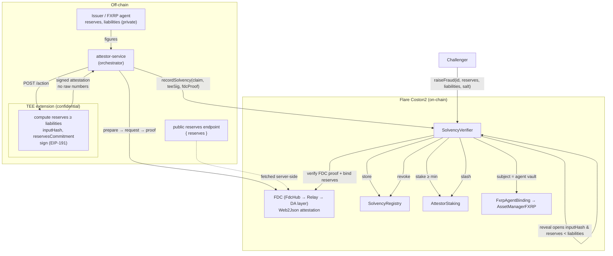

# Vouchsafe — Architecture & Data Flow

Private, stake-backed proof-of-solvency for RWA issuers and FAsset agents on Flare (Coston2).
An issuer proves `reserves ≥ liabilities` **without revealing the figures**, and loses staked collateral if the claim is later proven false.

## Data flow

## The two halves (both hackathon bounties)

- **Confidential Compute (Bounty 2):** the solvency computation and the private figures live inside the TEE
  extension. It emits only commitments (`inputHash`, `reservesCommitment`), the boolean result, and a signature.
  `SolvencyVerifier` recovers the signer and requires it to equal the registered `teeAddress` — the same
  ecrecover-based pattern Flare's `fce-weather-insurance` uses in `settle()`.
- **Interoperable Asset (Bounty 1):** an **FDC Web2Json** proof brings the off-chain reserves on-chain; the
  attestation binds to a **real FXRP agent** vault. `recordSolvency` requires **both** the TEE signature and the
  FDC proof, and checks that the FDC-attested reserves match the TEE claim's `reservesCommitment`.

## Commitment & fraud scheme

- `inputHash = keccak256(abi.encode(totalReserves, totalLiabilities, salt))` — commits to the full private input.
- `reservesCommitment = keccak256(abi.encode(totalReserves))` — binds the TEE's reserves to the FDC-attested value.
- **Fraud:** a challenger reveals the committed `(reserves, liabilities, salt)`. If they open the recorded
  `inputHash` **and** `reserves < liabilities`, the "solvent" claim was false → the stake is slashed (paid to the
  challenger) and the attestation revoked. No FDC proof is needed at challenge time — `inputHash` already fixes the
  reserves that were asserted, so post-recording reserve drift cannot shield a fraud. Liabilities stay private
  until a challenge (the intended RWA model: figures are disclosed to an auditor/counterparty who can challenge).

## On-chain contracts (Coston2, Solidity 0.8.25 / EVM cancun)

| Contract | Role |
|---|---|
| `SolvencyRegistry` | commitment-only attestation store, indexed by subject |
| `AttestorStaking` | stake / cooldown-unstake / slash, with a challenge-window lock |
| `SolvencyVerifier` | verifies TEE signature + FDC proof + stake; records; evidence-based `raiseFraud` |
| `VouchsafeInstructionSender` | FCC InstructionSender footprint (routes via `TeeExtensionRegistry` when available) |
| `FxrpAgentBinding` | resolves FXRP `AssetManager` + agent metadata via `FlareContractRegistry` |

## Simulated vs. real Confidential Space

Real on Coston2: the confidential computation, the TEE signature + on-chain `ecrecover`, the full FDC round-trip,
the FXRP agent binding, staking/slashing. Simulated: the enclave (a local process), remote attestation / code-hash
whitelisting, and the `TeeExtensionRegistry` round-trip (Flare has not published that registry on Coston2 yet).
The signing and on-chain verification are **identical** in both modes — only key custody and attestation differ.
Note the Flare `MODE` semantics: `MODE=0` = production attestation, `MODE=1` = simulated.
